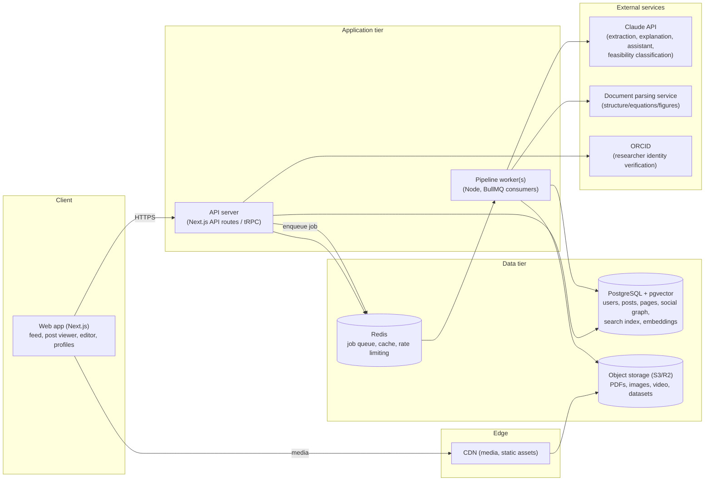
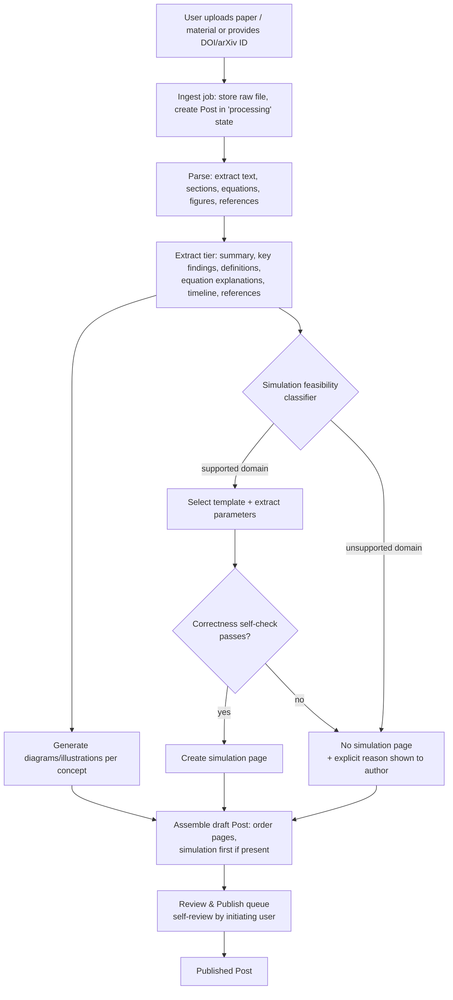

# Document 6: Technical Architecture

## Build approach — decision

**Custom full-stack codebase in this repository**, not a no-code/low-code accelerator (e.g., Lovable). Reasoning: the platform's two hardest, most differentiating pieces — the vertical-feed/horizontal-swipe interaction model (Doc 1) and the AI-driven simulation-generation pipeline (PRD §3.2) — both need architecture control that generated-app tooling doesn't give. Lovable-style tools are excellent for CRUD apps with a default backend; this is not that. This was an open question from earlier in the planning conversation and is resolved here as the working default.

## Guiding principles

1. **One language across the stack** (TypeScript, frontend + backend + workers) — small team, maximizes velocity, shared types between client/server.
2. **Boring, proven infrastructure for everything except the two things that actually differentiate the product.** No microservices, no bespoke vector DB, no exotic frontend framework — save architectural risk budget for the simulation engine and the AI pipeline.
3. **The AI pipeline must never execute AI-generated code.** Simulations are AI-*configured* (template selection + parameter extraction), not AI-*coded*. This is both a correctness strategy (Doc 1's quality gate) and a security boundary (Doc 12).
4. **Every pipeline stage is observable and resumable**, because Journey B requires showing real progress/status to the author, not a black-box spinner, and because LLM/parsing steps fail transiently and need retry without redoing everything.

## High-level system diagram



## AI post-generation pipeline (Path A, detailed)



Every stage writes a row to a `pipeline_run_steps` table (status, timestamps, error/reason) so the frontend can render real progress and the "no simulation generated — here's why" messaging required by Journey B.

## Frontend

- **Next.js (App Router) + TypeScript + React.** Server-side rendering for public post pages is a hard requirement, not a preference — Journey A requires a shared post link to render fully (including the simulation's initial state) before any signup wall, which needs SSR/streaming, not a client-only SPA.
- **Feed**: virtualized vertical list (windowing so only nearby posts are mounted — feed items are heavy: simulation canvases, images, embedded PDFs). Vertical scroll = between posts; horizontal paging within a post via scroll-snap + a lightweight carousel primitive (e.g., embla-carousel — small, accessible, unopinionated about content, good touch/gesture support for mobile-web).
- **Simulation rendering**: canvas/WebGL-based rendering layer, built as an internal package (`packages/simulation-engine`) containing a curated library of parametrized simulation templates (projectile motion, circuits, waves, etc.), each exposing a typed parameter schema. The AI pipeline never generates rendering code — it selects a template ID and fills its parameter schema. This is the concrete mechanism behind Doc 1's quality gate.
- **Styling/design system**: implemented per Doc 9, but architecturally: a shared component library package (`packages/ui`) consumed by the web app, built for light/dark mode and accessibility from the start (not retrofitted).
- **State/data fetching**: React Query (or tRPC's built-in equivalent) for server state; minimal client-only state (feed position, editor drafts).

## Backend

- **API layer**: tRPC (or Next.js API routes if tRPC's coupling to Next.js becomes limiting later) — type-safe client/server contract without hand-maintained REST schemas, appropriate for a single-frontend product at this stage. Full external API design in Doc 8.
- **Pipeline workers**: separate Node.js process(es) consuming a **BullMQ (Redis-backed)** queue. Decoupled from the API server because PDF parsing + multiple LLM calls per paper run well past serverless function time limits and must be retryable independently per stage.
- **Document parsing**: a dedicated parsing step (structure/sections/equations/figures) runs *before* LLM extraction — feeding raw PDF bytes directly to an LLM for long documents is both costly and less reliable than parsing structure first, then running targeted LLM extraction on structured text + isolated equation/figure regions. Build-vs-buy on the parser itself is an implementation-phase decision, not one to lock here.
- **LLM layer**: Claude API, called only from the worker tier (never client-side, both for key security and for provenance logging — every AI-generated page stores which model/prompt-version produced it, satisfying the PRD §3.1 provenance-tag requirement at the data layer, not just the UI layer).

## Data

- **PostgreSQL as the single database** for structured data (users, posts, pages, social graph, comments) *and* search: Postgres full-text search (tsvector/GIN) covers P0 search (PRD §3.6); the **pgvector** extension covers embeddings for semantic search and AI-assistant retrieval-augmented context (P1+), avoiding a separate vector database until scale genuinely demands one.
- **Redis** for the job queue, plus caching and rate limiting (upload endpoints, AI-assistant queries — both are abuse/cost vectors, see Doc 12).
- **Object storage** (S3-compatible — AWS S3 or Cloudflare R2) for PDFs, images, video, datasets, fronted by a CDN. Media delivery speed directly affects Journey A's "simulation interactive within 1-2s" requirement.

## Identity & verification

- Standard email/password + OAuth for general accounts.
- **ORCID** integration specifically for researcher/professor verification — it's the identity standard researchers already hold accounts on, and it's a stronger, lower-effort trust signal than a bespoke verification review process the platform would otherwise have to staff.

## Hosting & deployment (early-stage sizing)

- Frontend: Vercel (native Next.js fit, automatic scaling, preview deployments per PR — good fit for a small team's velocity).
- API + workers: a container-based platform (Fly.io or Railway at early stage; AWS ECS/Fargate if/when scale or compliance needs demand it) — chosen over serverless functions because worker processes need to run long jobs and hold persistent queue connections.
- Database: managed Postgres with pgvector support (e.g., Neon or Supabase's Postgres) — branching/preview-database support is a meaningful DX win for a small team iterating on schema.

## Repository structure (monorepo)

```
apps/
  web/              # Next.js frontend
  api/               # tRPC API server (or merged into web/ initially — see note)
  worker/            # pipeline job consumers
packages/
  simulation-engine/ # template library + rendering primitives
  ui/                # shared design-system components
  shared-types/      # types shared across apps (Post, Page, User, etc.)
docs/                # this planning series
```

pnpm workspaces + Turborepo — enough structure for a multi-app monorepo without the operational overhead heavier tools (Nx) add for a team this size. **Note**: at true MVP scale, `apps/api` may simply be `apps/web`'s API routes rather than a separate deployable — splitting it out is a when-needed step, not a day-one requirement; called out explicitly so we don't over-build before Doc 15 (MVP Scope) forces the real cut line.

## What's deliberately deferred (not architected now)

- Recommendation/ranking ML system (PRD explicitly P2)
- Multi-region / multi-database sharding (Doc 13, Scalability Plan, once real load data exists)
- Native mobile apps (PRD non-goal)
- Real-time (websocket-driven) notifications — polling/simple SSE is sufficient at launch scale
